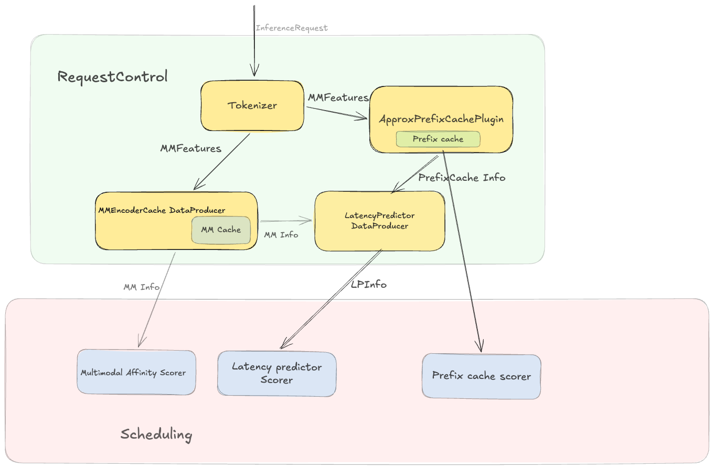

# Request-Control Data Producer Plugins

Data producer plugins run in the `PrepareRequestData` phase of the request-control pipeline, before filters and scorers execute. Each plugin implements `requestcontrol.DataProducer` and writes typed attributes onto endpoints or the `InferenceRequest` itself. Downstream plugins (scorers, filters, admission controllers) read these attributes without re-doing the computation.

The following diagram shows how producers are connected to the request control and scheduling plugins:

Producers may also implement additional lifecycle hooks:

- `PreRequest` — called after a routing decision is made; used to persist bookkeeping state (e.g., update a cache index, increment an in-flight counter).
- `ResponseHeader` / `ResponseBody` — called as response data arrives; used to collect training data or release in-flight counters.

## Available Producers

| Plugin type | Package | Produces | Summary |
|---|---|---|---|
| `token-producer` | [`tokenizer`](tokenizer/) | `TokenizedPrompt` | Tokenizes the request prompt via vLLM `/render`; required by precise-prefix-cache-producer and context-length-aware scorers. |
| `approx-prefix-cache-producer` | [`approximateprefix`](approximateprefix/) | `PrefixCacheMatchInfo` | Hashes the prompt into blocks and matches against a per-pod LRU index for approximate prefix-cache affinity. |
| `precise-prefix-cache-producer` | [`preciseprefixcache`](preciseprefixcache/) | `PrefixCacheMatchInfo` | Maintains a precise KV-block index by subscribing to vLLM KV-events; requires `token-producer` upstream. |
| `inflight-load-producer` | [`inflightload`](inflightload/) | `InFlightLoad` | Tracks real-time in-flight request and token counts per endpoint across the full request lifecycle. |
| `predicted-latency-producer` | [`predictedlatency`](predictedlatency/) | `LatencyPredictionInfo` | Trains XGBoost models via a sidecar and generates per-endpoint TTFT/TPOT predictions. |
| `session-id-producer` | [`sessionid`](sessionid/) | `SessionID` | Extracts a session identifier from a request header or cookie and publishes it for affinity-aware plugins. |
| `mm-embeddings-cache-producer` | [`multimodal`](multimodal/) | `EncoderCacheMatchInfo` | Tracks which pods recently processed each multimodal input hash and scores encoder-cache affinity. |

## Plugin ordering and dependencies

The framework resolves a DAG from each plugin's `Produces` and `Consumes` declarations and runs producers in dependency order. Explicit dependencies to be aware of:

- `precise-prefix-cache-producer` **requires** `token-producer` upstream (it consumes `TokenizedPrompt`).
- `mm-embeddings-cache-producer` **optionally** consumes `TokenizedPrompt`; configure `token-producer` first when multimodal features need tokenizer-derived hashes.
- `inflight-load-producer` **optionally** consumes `PrefixCacheMatchInfo` from an approx or precise prefix producer; prefix-discounting is applied automatically when the attribute is present.
- `predicted-latency-producer` **optionally** consumes `PrefixCacheMatchInfo`; set `prefixMatchInfoProducerName` in its config to the name of the prefix producer instance.

## Related documentation

- [Approximate Prefix Cache Producer](approximateprefix/README.md)
- [Precise Prefix Cache Producer](preciseprefixcache/README.md)
- [Token Producer](tokenizer/README.md)
- [In-Flight Load Producer](inflightload/README.md)
- [Predicted Latency Producer](predictedlatency/README.md)
- [Session ID Producer](sessionid/README.md)
- [Multimodal Embeddings Cache Producer](multimodal/README.md)
